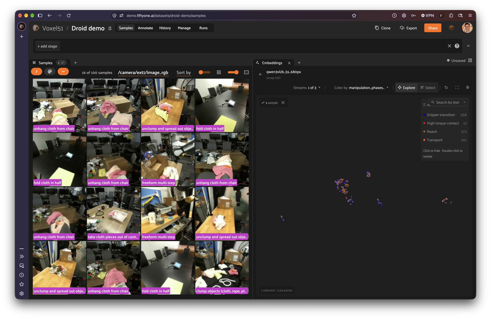
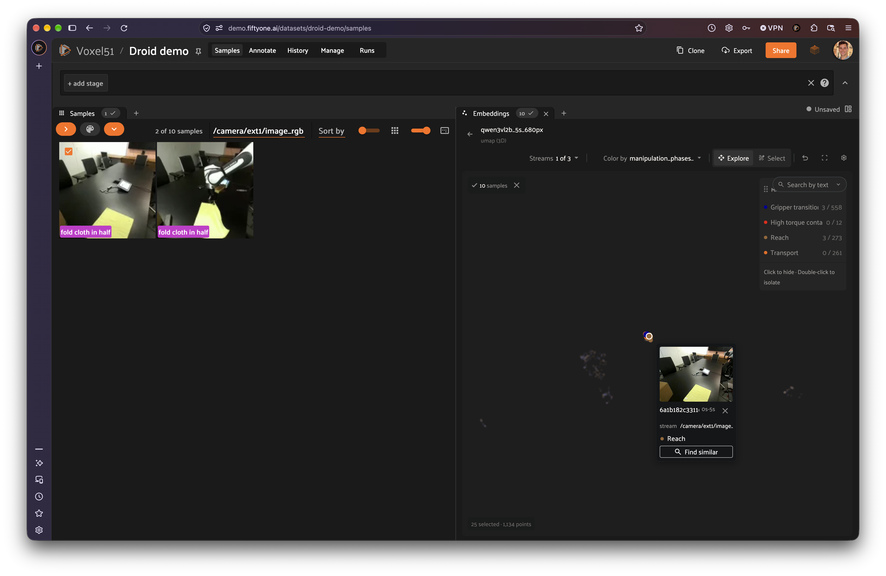
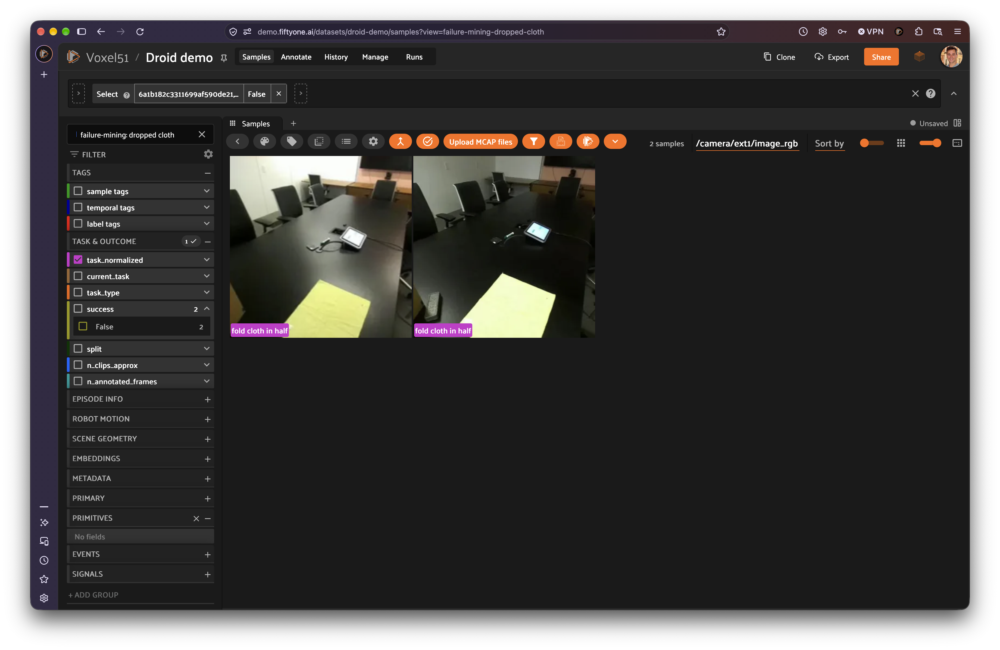

# Failure Mining in Robotics: Find One Failure, Surface Every Similar Case

You review an episode and spot it: the gripper is folding a cloth in half,
and halfway through the fold the corner slips out of its fingers. One failure,
found. The harder question is how many more are sitting in the rest of your
data.

For most teams, the answer comes from scrubbing recordings one at a time.
That's the needle-in-a-haystack problem robotics teams describe over and over:
one team has 4,000 hours of recordings to search, another says the edge cases
that matter are exactly the ones that are hardest to capture. A single failure
tells you _what_ went wrong. Failure mining tells you _how often_ and _where
else_, and that's what you need before you can fix it with data.

This repo walks through failure mining on a real robot dataset in FiftyOne:
start from one failure, use embedding similarity search to surface every
similar moment, narrow the list to real failures, and tag them into a curated
set ready for retraining or evaluation.

**What you'll need:** the [companion notebook](failure_mining.ipynb), `pip install fiftyone`, and the
[DROID multimodal dataset](https://huggingface.co/datasets/dgural/droid-mcap-demo)
on Hugging Face: 100 teleoperated robot episodes stored as MCAP recordings,
with three synchronized cameras, point clouds, and per-episode task and
outcome fields. Steps 1, 3 and 4 work in open source FiftyOne. Step 2, the
similarity search, uses FiftyOne Enterprise and is marked as such.

## Step 1: Find the seed failure

Load the dataset and open it in the App:

```python
import fiftyone as fo
from fiftyone.utils.huggingface import load_from_hub

dataset = load_from_hub("dgural/droid-mcap-demo")
session = fo.launch_app(dataset)
```

Each sample is one episode. Opening it shows every sensor on a shared playback
clock, so the external cameras, the wrist camera and the 3D view all scrub
together. Our seed is episode `AUTOLab+44bb9c36+2023-11-26-15h-53m-47s`, a "Fold
cloth in half" task: at about 6.6 seconds, the cloth corner drops out of the
gripper before the fold completes.

The dataset already has automatically generated phase tags on its timeline,
`grasp` and `release`. Look at what they call this moment:


To the phase labeler, the drop is a normal `release`: the gripper opened and
the cloth left it. Only a reviewer knows the robot didn't mean to let go. Keep
that in mind; it comes back in step 3.

Record the failure with a **temporal tag**, which marks a time interval inside
an episode rather than the whole episode. In the App, Shift+drag across the
timeline and type the tag. Or in code:

```python
import fiftyone.core.tags as fota
from fiftyone import ViewField as F

seed = dataset.match(
    F("filepath").ends_with("AUTOLab+44bb9c36+2023-11-26-15h-53m-47s.mcap")
).first()

# start/end are nanoseconds from the start of the recording
dataset.temporal_tags.add(
    fota.TemporalTag(seed.id, start=6_600_000_000, end=7_070_000_000,
                     tag="failure: dropped cloth")
)
```

## Step 2 (FiftyOne Enterprise): One failure, many similar cases

> **🚀 FiftyOne Enterprise.** Segment-level embeddings search runs on FiftyOne
> Enterprise, where it indexes every window of every recording across your
> full fleet.

FiftyOne Enterprise computes an embedding for each short window of each
camera stream (here, 5-second windows with the Qwen3-VL-Embedding-2B model),
so search works at the level of _moments_, not whole episodes.

In the Embeddings panel, pick the run, set **Streams** to a single camera,
click the point for the seed's dropped-cloth window, and choose **Find
similar**. Every window that looks like the seed lights up, and the grid fills
with the episodes they come from:



From a single failure, the search surfaced 16 cloth-handling episodes across
different scenes and tasks: folding, unclumping, unhanging cloth from a chair.
Two tips if you try this on your own data: compare one camera stream at a
time (otherwise the same moment seen by the robot's other cameras ranks
first), and clear grid filters first, since the search is scoped to the
current view.

[Video: the full find-similar → scope → review flow, 42 s](https://drive.google.com/file/d/19GwHUttGUycsbzcjx9PN8CgI_4MAnFlY/view?usp=sharing)

## Step 3: Narrow the list to real failures

Here's the part most write-ups skip. **Similarity search finds similar
situations, not failures.** Embeddings capture what's visible: a gripper, a
cloth, the cloth leaving the gripper. They don't capture intent. A cloth
dropped by accident and a cloth placed on purpose look nearly identical, which
is why text queries like "failed to pick up cloth" mostly return deliberate
placements, and why the phase labeler called our failure a `release`.

So the useful move is to combine the search with what you already know about
each episode. DROID records whether each episode succeeded, so scope the
search to failed episodes before running it:

```python
failed = dataset.match(F("success") == False)
```

Then run **Find similar** from the same seed again:



The list drops to two episodes: the seed and a second failed fold, where the
cloth slips at about 11.2 seconds and the robot re-grasps at the end. Two
candidates to review instead of scrubbing every failed episode by hand. The
same approach generalizes: a seed from a cloth-and-string separating task
returned three matching episodes of that task.

This is the honest version of failure mining: **search turns a haystack into
a short review list, and a human confirms**. Metadata like success flags, task
labels or model confidence makes the list shorter; review makes it correct.

## Step 4: Tag the confirmed failures and save the set

Review each candidate with synced playback, and temporal-tag the ones that
are real failures, the same way as the seed. Then turn the tags into a
reusable set:

```python
view = dataset.match_temporal_tags(tags="failure: dropped cloth")
dataset.save_view("failure-mining: dropped cloth", view)
```



The saved view updates as you tag more failures, and anyone on your team can
open it from the views menu. Because the tags mark exact intervals, they also
give you the training or evaluation clips themselves, not just the episodes
that contain them. To hand the set to a training or evaluation pipeline,
export the tags of the episodes in the view (this includes their phase tags,
so the failure interval comes with its context):

```python
fota.export_tags(view, "dropped_cloth_tags.json")
```

## Run failure mining on your own data

The loop is short: find one failure, search for similar moments, narrow with
the metadata you have, confirm, and tag. Every pass adds labeled failures to
the set you retrain and evaluate on, which is how a data flywheel actually
turns.

- **Companion notebook:** [`failure_mining.ipynb`](failure_mining.ipynb) runs
  steps 1, 3 and 4 in open source FiftyOne and describes the Enterprise search step
- **Related:** [Introducing Voxel51 Search](https://voxel51.com/blog/fiftyone-search-multimodal-data),
  [Segment-Level Embeddings](https://voxel51.com/blog/segment-level-embeddings)

## Run it yourself

```bash
pip install -r requirements.txt
jupyter notebook failure_mining.ipynb
```

The notebook loads a 10-episode subset by default
([`dgural/droid-mcap-workshop`](https://huggingface.co/datasets/dgural/droid-mcap-workshop),
0.8 GB) that includes the seed episode; switch `REPO` to
[`dgural/droid-mcap-demo`](https://huggingface.co/datasets/dgural/droid-mcap-demo)
for all 100 episodes (10.4 GB).

## Credits and license

The data is derived from [DROID](https://droid-dataset.github.io) and is
licensed CC-BY-4.0. The code in this repo is licensed under Apache 2.0.
